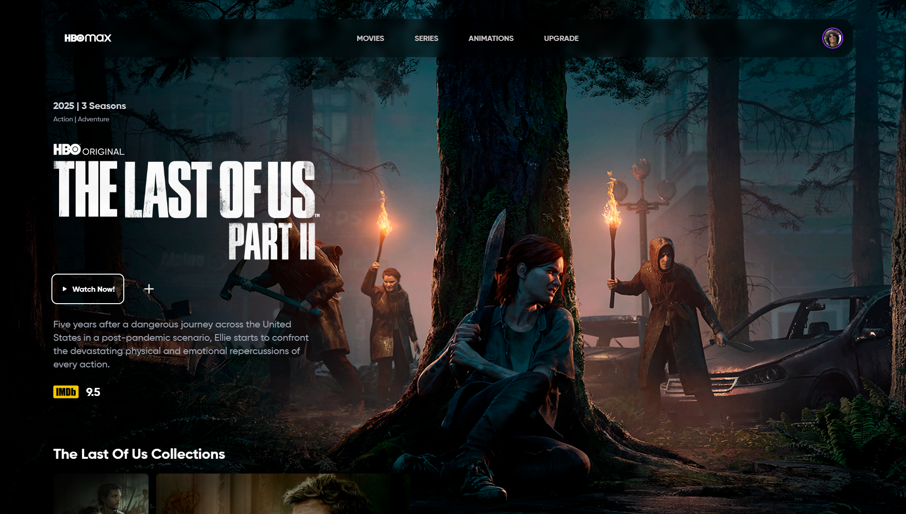
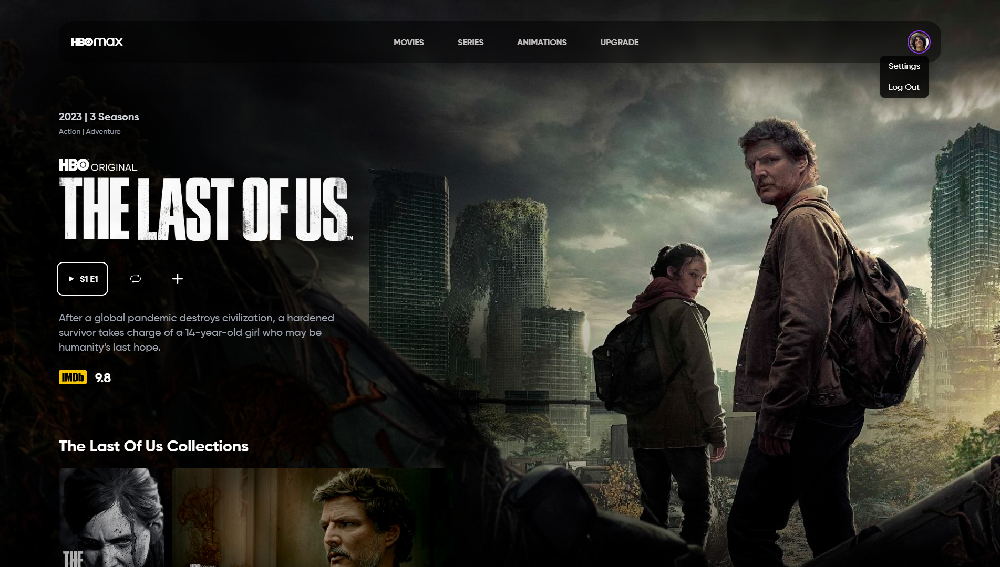

<h1 align="center">
  The Last Of Us: Part II - HBO Max
</h1>

  

  

  <a href="#-tecnologias">Tecnologias</a>&nbsp;&nbsp;&nbsp;|&nbsp;&nbsp;&nbsp;
  <a href="#-projeto">Projeto</a>&nbsp;&nbsp;&nbsp;|&nbsp;&nbsp;&nbsp;
  <a href="#memo-licença">Licença</a>

 

## 🚀 Tecnologias

Esse projeto foi desenvolvido com as seguintes tecnologias:

- HTML
- [Tailwind CSS](https://tailwindcss.com/)

## 🚧 Projeto:

Em construção

## 🎨 Inspiração:

Figma: https://www.figma.com/file/2A51gQJCk5V6LxcIh2en0b/HBO-Max-Redesign-Web-App-(Community)

## :memo: Licença

Esse projeto está sob a licença MIT. Veja o arquivo [LICENSE](LICENSE) para mais detalhes.

---
